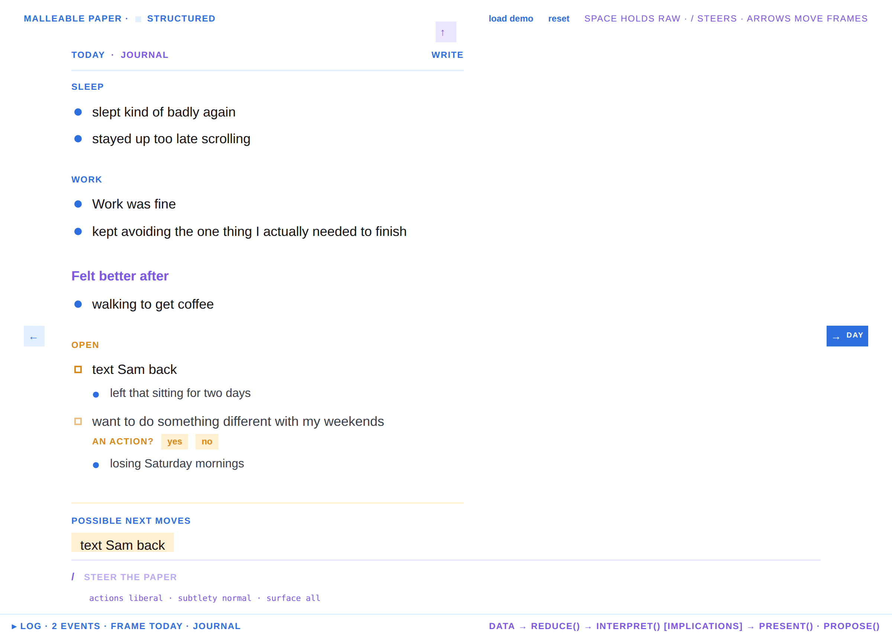
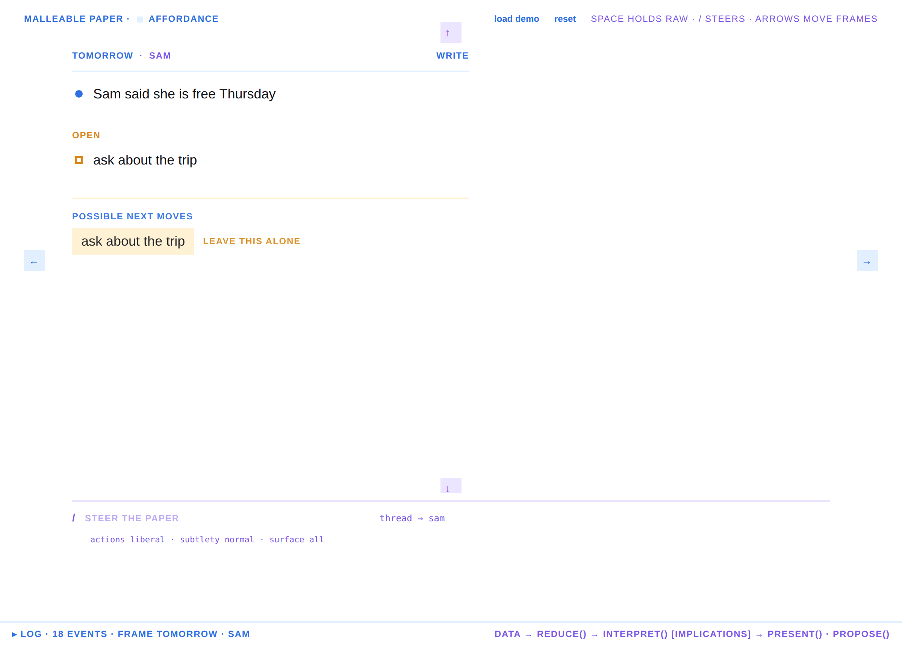
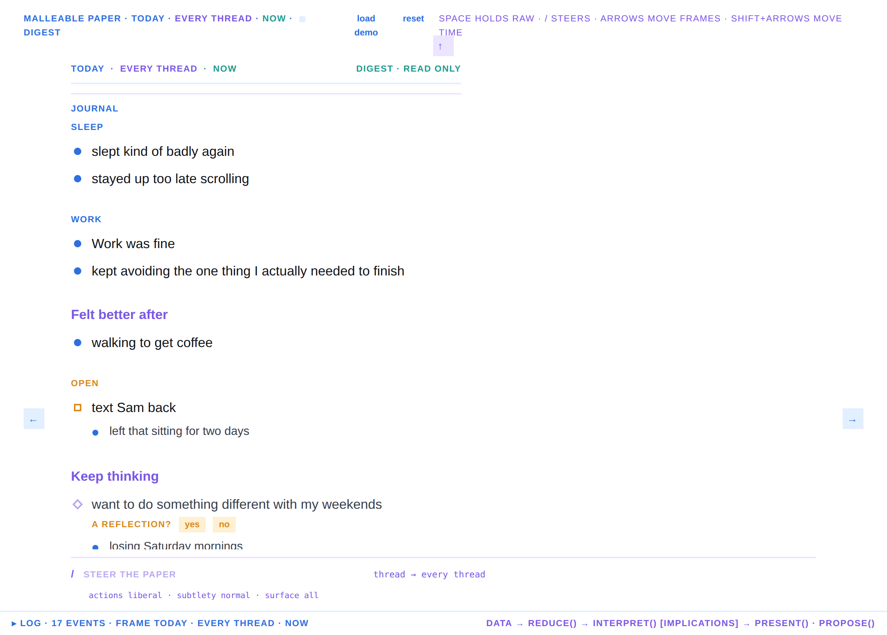
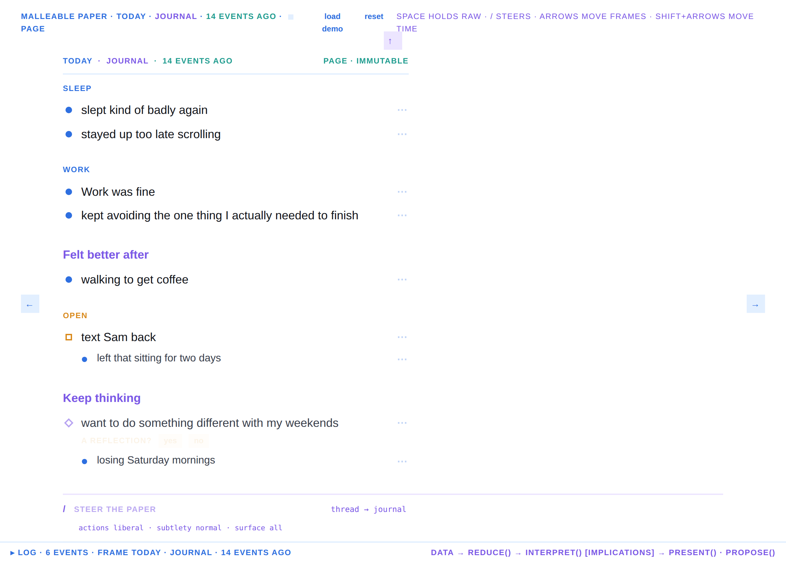
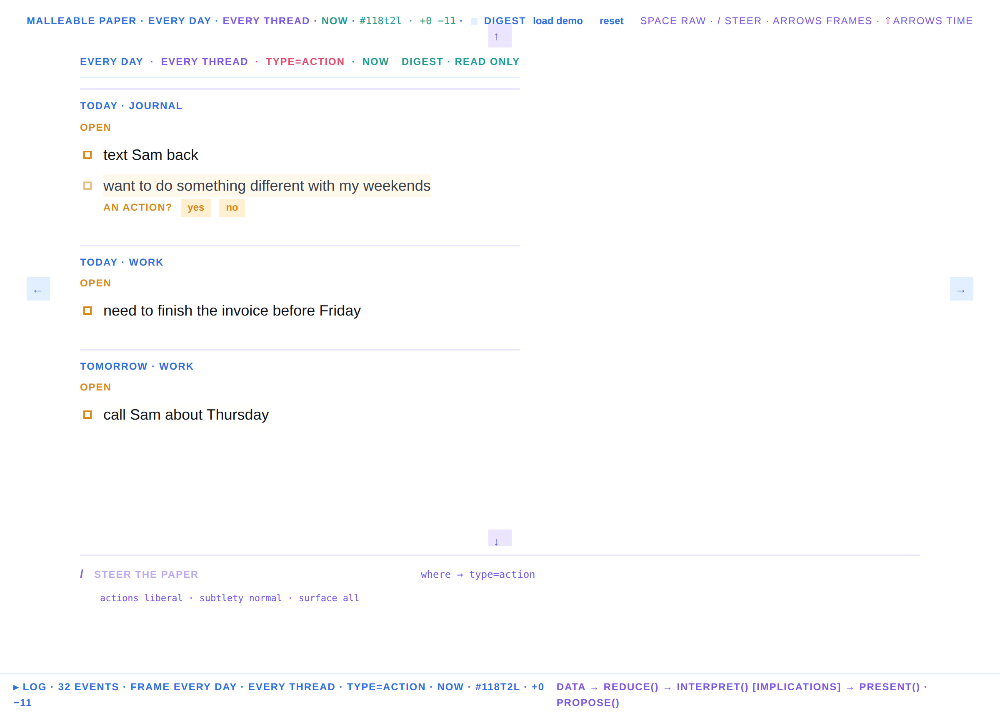
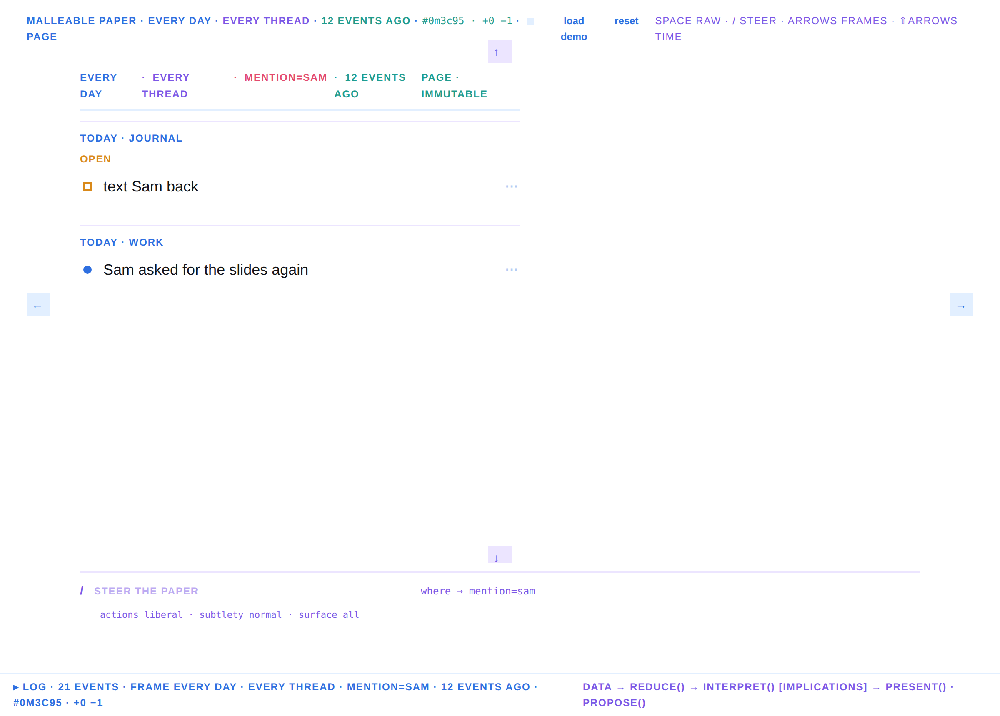
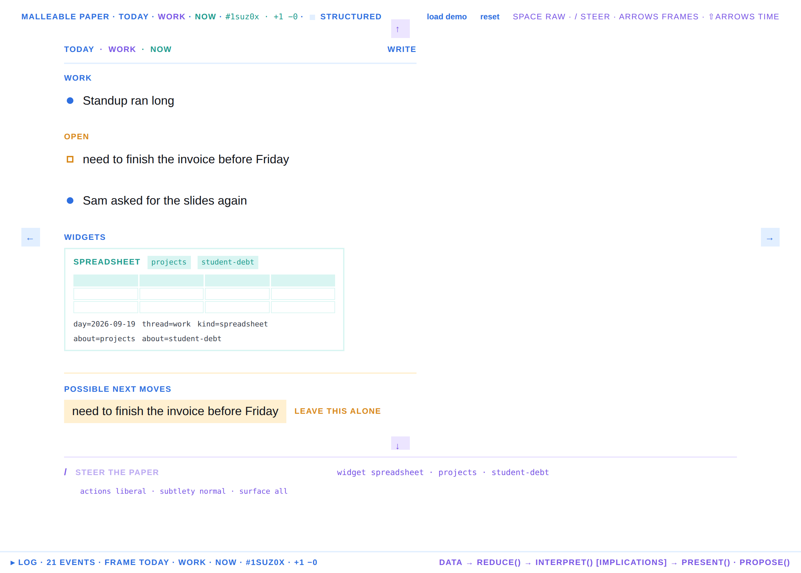
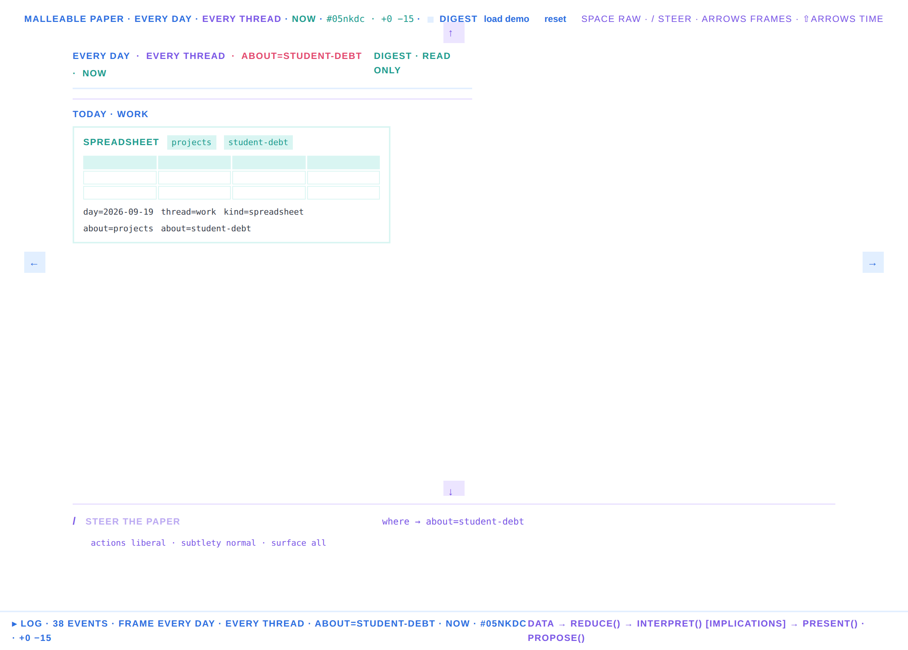
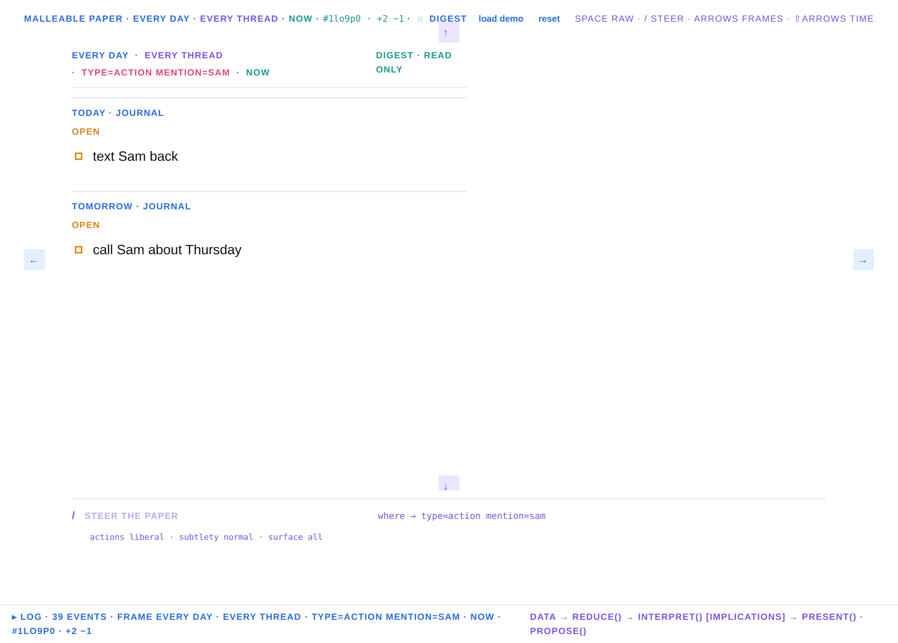
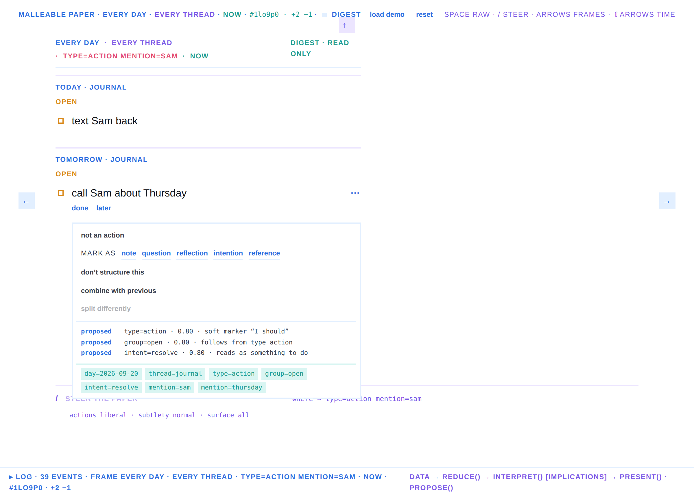

# Walkthrough — the paper writes back

Every frame below was captured from the running prototype at 2× scale by
`docs/walk.ts` (Playwright). The sequence is one session: write, watch,
tend, steer, pin, connect, nest, hold raw, inspect, move to the next frame.

## 1. Writing

The paper starts empty. There is no chrome: a frame id, a state word, two
text buttons, a hint line, and a command line at the bottom.

A messy paragraph goes into the Wordgard editor. The state word says
*reading* while the two-second idle timer runs.

## 2. The paper writes back

**Lift.** The exact spans that will move are highlighted where they sit in the
paragraph. Everything else is glue and starts to fade.

**Move.** The same spans fly to their places. Nothing else is drawn yet: no
headings, no markers, no buttons. Whitespace opens between the groups.

**Settle.** Markers and colour arrive. Typography changes only now.

**Structured.** Generated headings (*Sleep*, *Work*, *Open*) and the authored
heading *Felt better after* are in. The soft action gets a question,
*an action? yes / no*, and the doer proposes two next moves.

## 3. Tending

Hover a block: its affordances (*done / later*) and the ⋯ appear.

The ⋯ menu is the tend menu. Below the actions it lists the implications the
paper holds about this block, with state, confidence and reason.

Press **no** on *an action?*. The block leaves *Open* and settles under the
authored heading *Keep thinking* as a reflection. Its next move is gone.
The rejection is durable: that claim is never proposed again for this phrase.

## 4. Steering

Press **/**. The command line wakes and shows the seed commands. This is the
whole chat: it tends the agent's intentions, it never talks.

*Don't turn casual thoughts into tasks.* → `actionInference → explicit-only`.
*Open* becomes *Intentions* with diamond markers; no next moves.

## 5. The plane

Drag a phrase out of the column and it is pinned where you drop it. Drag a
second one near it and the scanner emits `a|near=b`; the doer offers
*connect these?*.

Confirming it is the connection: a dotted teal line and a *connected* tag.
Dropping a third block indented under another offers *group under?*.

Confirming re-nests the child. Everything on the plane is the same object it
was in the column.

## 6. Raw

Hold **Space**: the original paragraph shows through the structure, spans in
place, glue in blue.

## 7. The log

The drawer shows the three stores side by side: events (authoritative), the
implication list with states, the presentation and the proposals.

## 8. Frames

The margin arrows or the arrow keys move to the adjacent frame on the plane.
Each frame has its own text, tends and pins.

## 9. A frame is a coordinate

The title is a tuple along two bases, day and thread. Arrow keys step one
basis: left and right move a day, up and down move a thread. `/thread sam`
opens a thread; a frame nobody has written in is empty, not missing.

## 10. A frame is a query; a page is a snapshot

An unbound component (`/thread *`, `/day *`) makes a digest: read-only, every
member rendered with its own handlers. Shift+Arrow moves a cut through the
log. A page is the query plus the cut, immutable. `/snapshot` records the page
as a `page_rendered` event with the result hash.

## 11. Content by query

`/where type=action` selects across every day and thread. The frame's identity
is the hash of the ids in the result set; the top bar shows the hash and the
diff against the previous result. Scrubbing time on the same query shrinks the
set and changes the hash.

## 12. Objects are return sets

Every object carries keys: triples of the form `object key=value`. Text
objects get day, thread, type, group, intent and one `mention=` per
capitalised word. Widgets get day, thread, kind and one `about=` per tag.

`/widget spreadsheet projects student-debt` creates a widget in the work
thread today.

A day later, in the journal thread, the widget is not there by place. It is
there by query: `/where about=student-debt` across every day and thread
returns it.

Patterns conjoin. `/where type=action mention=sam` returns the two actions
that mention Sam and nothing else.

The tend menu shows the keys under the implications, so the question
"which queries return this?" has an answer on the block itself.

## Design notes for the next round

* Authored vs generated now rests on size, weight, case and colour alone.
* Markers are geometry: disc note, square action, ring question, diamond
  reflection, filled diamond intention, triangle reference. Green when
  confirmed.
* Pastel pairs: blue machine, amber open, green human, rose attention, violet
  intent, teal links. No greys anywhere.
* The command line sticks to the bottom so `/` never scrolls the paper.
